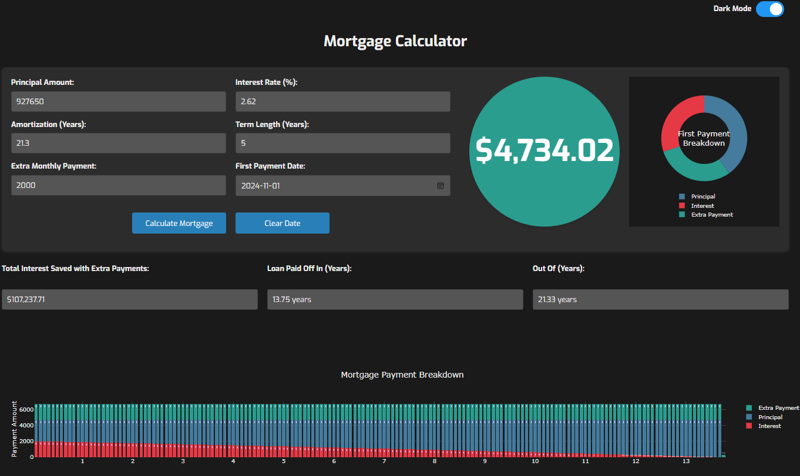

# Mortgage Calculator with Plotly.js

An interactive mortgage calculator that helps you understand your mortgage payments, interest savings with extra payments, and visualize various aspects of your mortgage through interactive charts using Plotly.js.

**Try it out here:** [Mortgage Calculator](https://richardmalo.github.io/MTGPlotly/)

## Table of Contents

- [Features](#features)
- [Demo](#demo)
- [Usage](#usage)
- [Installation](#installation)
- [Project Structure](#project-structure)
- [Dependencies](#dependencies)
- [Contributing](#contributing)
- [License](#license)
- [Acknowledgments](#acknowledgments)

## Features

- **Mortgage Calculations:**
  - Calculate monthly mortgage payments based on principal, interest rate, amortization period, and term length.
  - Include extra monthly payments to see their effect on loan term and total interest paid.
- **Interactive Charts:**
  - **Mortgage Payment Breakdown**: Visualize how each payment is split between principal, interest, and extra payments.
  - **Cumulative Payments Over Time**: See the total amount paid over time.
  - **Equity Build-up Over Time**: Track how your home equity increases over time.
  - **Interest vs. Principal Components Over Time**: Understand the changing composition of your payments.
  - **Annual Payment Summary**: Summarize payments on an annual basis.
  - **Effect of Extra Payments on Loan Term**: Explore how different extra payment amounts reduce your loan term.
  - **Effect of Extra Payments on Total Interest Paid**: See how extra payments reduce total interest.
  - **Comparison Charts**: Compare scenarios with and without extra payments.
- **Amortization Schedule:**
  - Detailed table showing each payment, interest paid, principal paid, extra payments, and remaining balance.
- **Dark Mode Support:**
  - Toggle between light and dark themes for better readability.
- **Print Functionality:**
  - Print charts and amortization schedule directly from the web page.

## Demo



## Usage

1. **Access the Calculator:**
   - Visit the [Mortgage Calculator](https://richardmalo.github.io/MTGPlotly/) web page.

2. **Input Your Mortgage Details:**
   - **Principal Amount**: The total loan amount.
   - **Interest Rate (%)**: Annual interest rate (e.g., 3.5%).
   - **Amortization Period (Years)**: Total years to pay off the mortgage.
   - **Term Length (Years)**: Length of the mortgage term.
   - **Extra Monthly Payment**: Additional amount paid monthly.
   - **First Payment Date (Optional)**: Start date for the amortization schedule.

3. **Calculate:**
   - Click the **Calculate Mortgage** button to generate results.

4. **View Results:**
   - Review calculated fields such as total interest saved and loan payoff time.
   - Explore interactive charts and amortization schedule.

5. **Additional Options:**
   - Use the **Dark Mode** toggle for a different theme.
   - Click **Print Charts** or **Print Amortization Schedule** to print.

## Installation

To run the project locally:

1. **Clone the Repository:**

   ```bash
   git clone https://github.com/yourusername/MTGPlotly.git